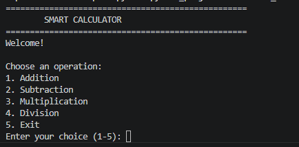

# 🧮 Smart Calculator

A command-line calculator built using Python.

## Features

- Addition
- Subtraction
- Multiplication
- Division

## Technologies Used

- Python 3.12
- Git
- GitHub
- VS Code

## Project Status

🚧 Currently under development.
## Screenshot

## Author

Josh